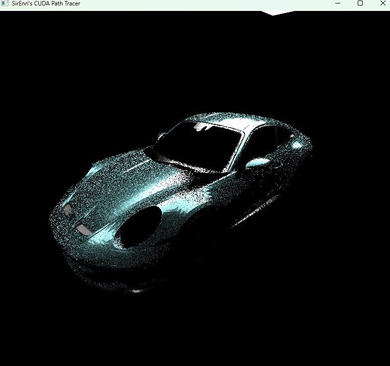

CUDA Path Tracer
================

**University of Pennsylvania, CIS 565: GPU Programming and Architecture, Project 3**

* Henry Han
  * https://github.com/sirenri2001
  * https://www.linkedin.com/in/henry-han-a832a6284/
* Tested on: Windows 11 Pro 24H2, i7-9750H @ 2.60GHz 16GB, RTX 2070 Max-Q

# Description

## Core Features

- Shading kernel with BSDF evaluation with PBR materials
- Stream compacted path termination, using thrust::remove_if with indexing the path segments
- Sorting by BVH id / Object id
- Stochastic sampled antialiasing

## Extended Features

**Visual Improvements**

- Multiple Importance Sampling by direct sample light source
- BaseColor Textures Mapping
- Optimized GGX NDF sample
- Mesh Light

**Mesh Improvements**

- gltf scene loading + obj mesh loading

**Performance Improvements**

- BVH combined with Octree, constructed on GPU side
Other Improvements

**Other Features**
- Commandlet Mode Execution (specific for nsight compute)
- Use RenderProxy pattern to manage meshes and textures, as well as distinguish between address spaces.

# Screenshots

**Physically Based Materials**

**OBJ Model Loader + Texture**

**gltf Scene Loader + Texture**

**Bounding Volumn Hierarchy + Octree**

# Performance Analysis

## BVH Performance Boosts

## NSight Compute Analysis

# Third-parties

[stb_image]()

[tiny_obj]()

[tiny_gltf]()

## Meshes

[Blender Demos](https://www.blender.org/download/demo-files/)

[Spot the cow](https://www.cs.cmu.edu/~kmcrane/Projects/ModelRepository/)

[Stanford Bunny](https://graphics.stanford.edu/data/3Dscanrep/)

