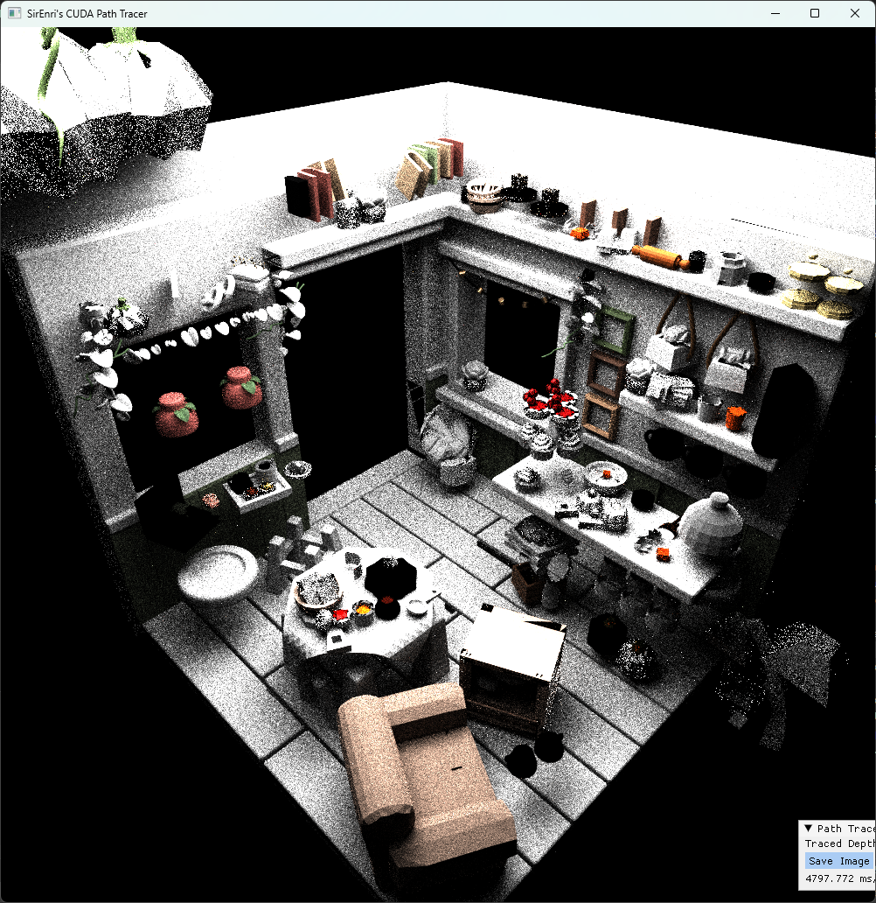
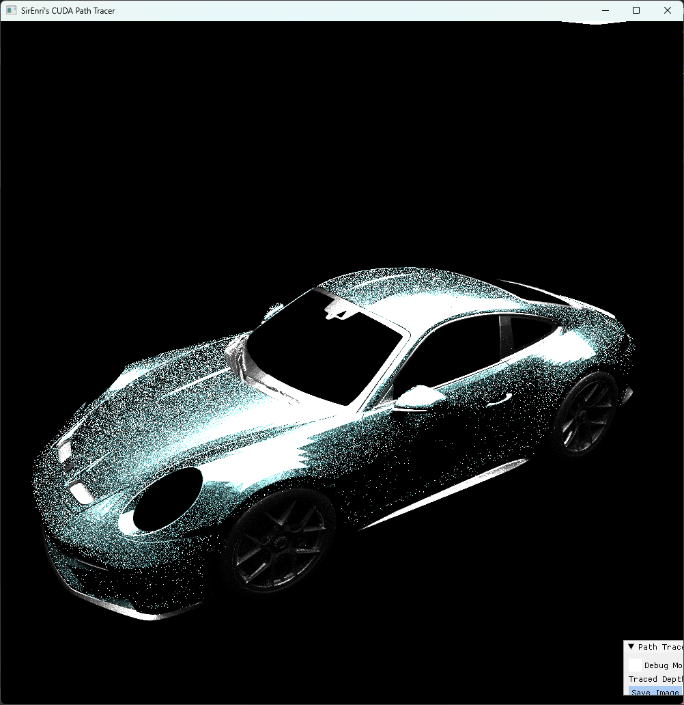
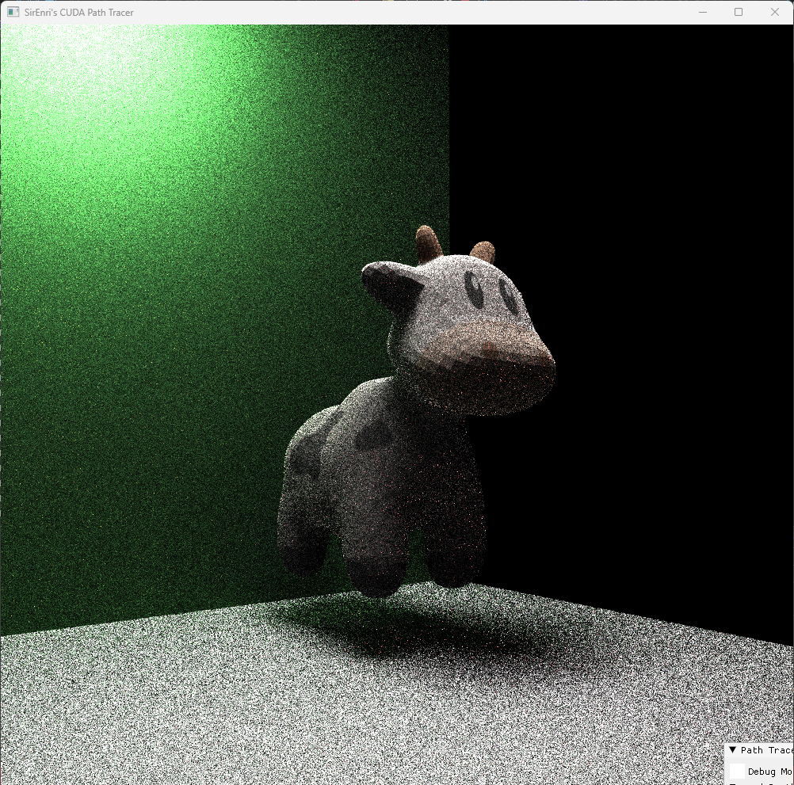
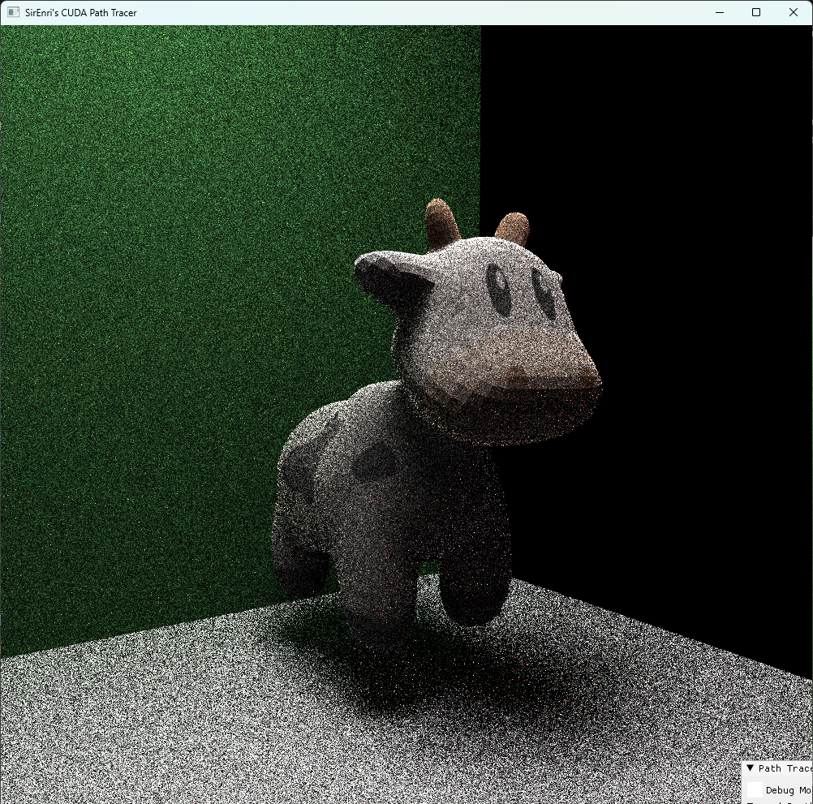
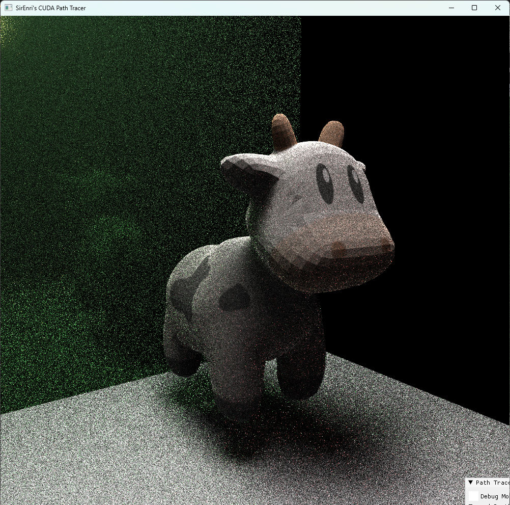
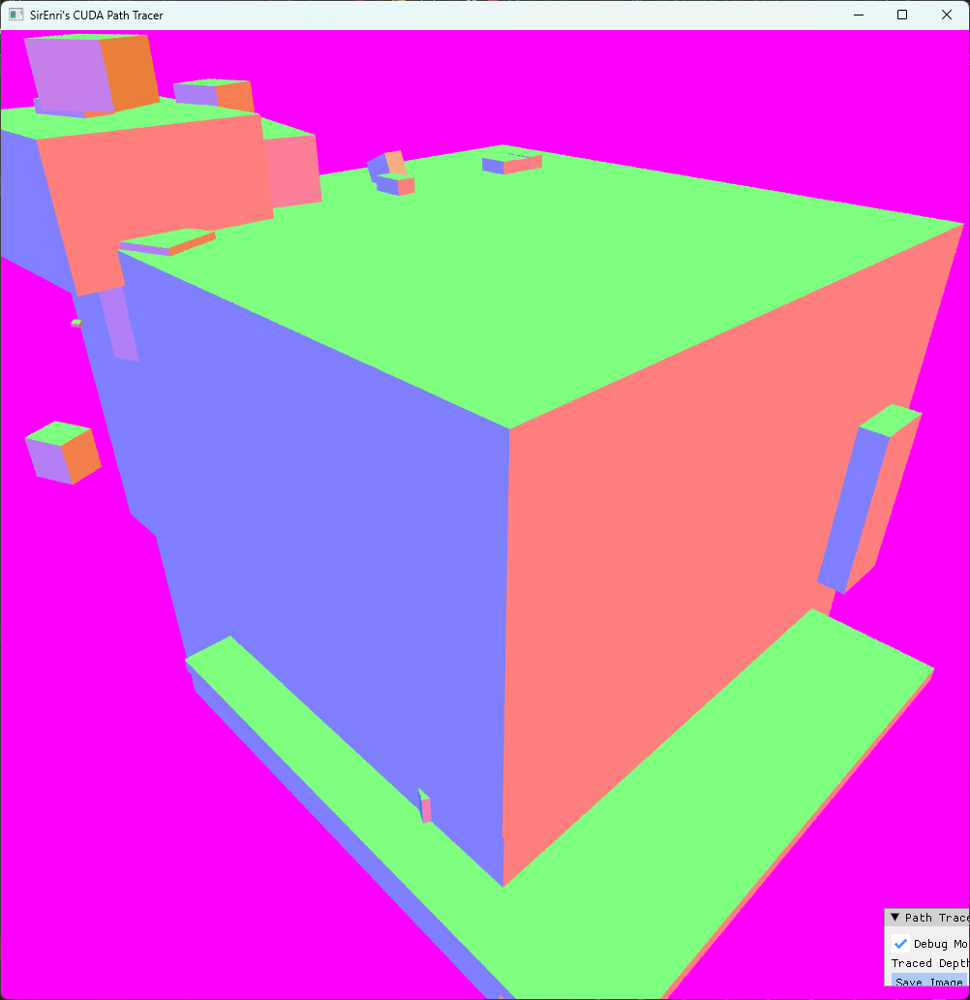
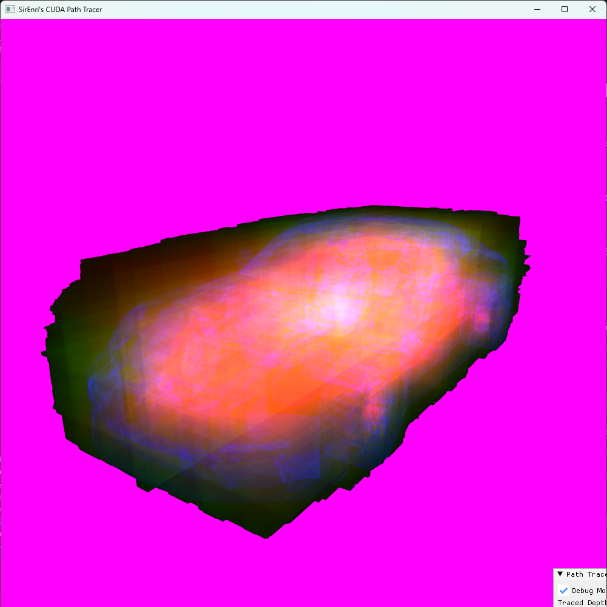
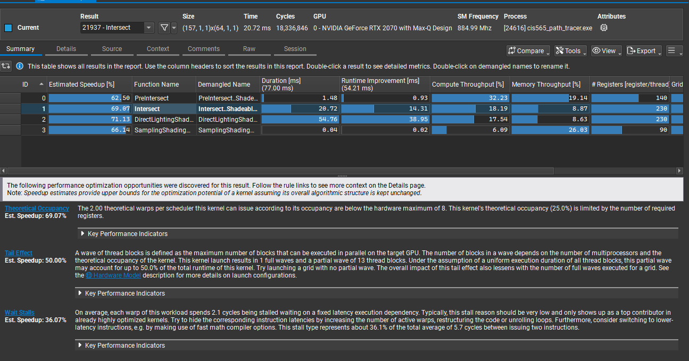
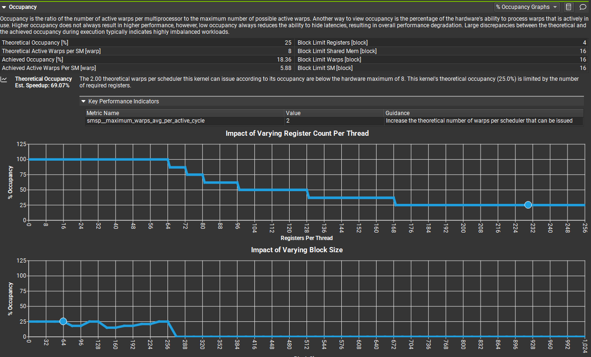

CUDA Path Tracer
================

**University of Pennsylvania, CIS 565: GPU Programming and Architecture, Project 3**

* Henry Han
  * https://github.com/sirenri2001
  * https://www.linkedin.com/in/henry-han-a832a6284/
* Tested on: Windows 11 Pro 24H2, i7-9750H @ 2.60GHz 16GB, RTX 2070 Max-Q

Scene with 333 objects, 167 materials.

Scene with 36 objects, xx materials with total triangles of 24.

# Description

## Core Features

- Shading kernel with BSDF evaluation with PBR materials
- Stream compacted path termination, using thrust::remove_if with indexing the path segments
- Sorting by BVH id / Object id
- Stochastic sampled antialiasing

## Extended Features

**Visual Improvements**

- Multiple Importance Sampling by direct sample light source
- BaseColor Textures Mapping
- Optimized GGX NDF sample
- Mesh Light

**Mesh Improvements**

- gltf scene loading + obj mesh loading

**Performance Improvements**

- BVH combined with Octree, constructed on GPU side

**Other Features**
- Commandlet Mode Execution (specific for nsight compute)
- Use RenderProxy pattern to manage meshes and textures, as well as distinguish between address spaces.

# Screenshots

**Physically Based Materials**

Object with texture as base color. Wall roughness: 0.5

Object with texture as base color. Wall roughness: 1.0

Object with texture as base color. Wall roughness: 0.1

**Bounding Volumn Hierarchy + Octree**

Bounding Volume

Octree Structure

# Performance Analysis

## Testing Parameters

**Running params**

 --xy 1000 --depths 4 ../models/scene.gltf

**Compiling params**

MinSizeRel with option -lineinfo (convenient for debugging)

## BVH Performance Boosts (Rendering Blender Sample Scene)

| Acceleration| Render Time per Frame(Blender Scene) | Render Time per Frame(Car Scene) |
|-----------|-----------|------|
| No Acceleration    | 41936.4 ms   | 24285.9 ms |
| Only Bounding Volume    | 5284.82 ms   | 13235 ms |
| 2 Layer Octree (max at 4x4x4) | 7609.83 ms | 8969.72 ms |
| 2 Layer Octree with root optimized | 6548.51 ms | 8601.92 ms |
| 3 Layer Octree (max at 8x8x8) | 8006.78 ms | 4028.4 ms| 
| 3 Layer Octree with root optimized | 6362.03 ms | 3678.27 ms| 

The result shows octree is more effective toward large mesh object, such as cars, whereas for a scene with many small object(like shown above), it does not provide a good result. 

But why my octree is so slow? Even for large objects like cars, it should provide more speed. So I choose to use nsight tool to see what is going on inside. 

## NSight Compute Analysis

**Params** --xy 100 --gui 0 --depths 1 --frames 1 ../models/scene.gltf

**Kernel filter** regex:"PreIntersect|Intersect|DirectLightingShadingPathSegments|SamplingShadingPathSegments"

### Result

It turned out that only 2 out of 8 warps in SM are executed. This is caused by I used many registers (220 in total) that became the main bottleneck.

So optimizing the number of registers used can be next step of work.

# Third-parties

[stb_image](https://github.com/nothings/stb)

[tiny_obj](https://github.com/tinyobjloader/tinyobjloader)

[tiny_gltf](https://github.com/syoyo/tinygltf)

## Meshes

[Blender Demos](https://www.blender.org/download/demo-files/)

[Spot the cow](https://www.cs.cmu.edu/~kmcrane/Projects/ModelRepository/)

[Stanford Bunny](https://graphics.stanford.edu/data/3Dscanrep/)

[Car](https://sketchfab.com/3d-models/2024-porsche-911-st-f39f7c539a3440428c22a3da2f52af43)
